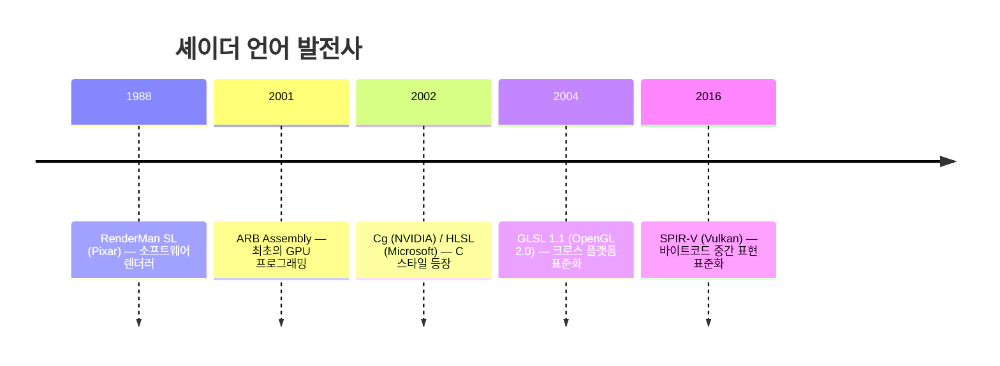
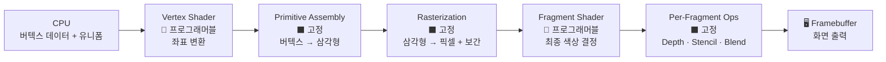

# 📅 TIL 2026-04-28: 3D 그래픽스 파이프라인 (인프런 OpenGL 강좌)

> **게임 개발자를 위한 3D 그래픽스, 쉐이더, OpenGL** — 2강 (21-B · 21-C · 21-D)

---

오늘 openGL 강좌를 수강했다
강사님께서 셰이더가 어떻게 구성되고 처리되는지에 대해 설명해주셨는데 이해가 너무 잘 되었다
사실 그래픽스의 기초를 좀 계속 봤지만 구멍이 너무 많아서 이해가 도저히 안갔는데, 이제 조금씩 읽히는 느낌이다
한달동안 그냥 계속 고민하고 이게 대체 뭔지 처음엔 외계어처럼 느껴졌지만 하나씩 이해가 되는 걸 보니 그래도 점점 나아지고 있는 것 같아서 기쁘다
지금은 더딜지라도 지금처럼만 꾸준히 하면 나중엔 기하급수적으로 실력이 늘것 같다
자신감을 갖고 지금처럼 멈추지만 말고 꾸준히 하도록 하자

---

## 1️⃣ Today I Learned

### ① 고정 기능 → 프로그래머블 파이프라인 전환

초기 GPU는 **Fixed Function Pipeline** 이었다. 개발자는 파라미터만 설정할 수 있었고, 조명 방정식·텍스처 합성 방식 등 로직 자체는 하드웨어에 고정되어 있었다.

```
[고정 기능 시대의 한계]
할 수 있는 것 → glLightfv(), glMaterialfv() 등 파라미터 조정
할 수 없는 것 → 조명 방정식을 바꾸는 것, PBR·커스텀 효과 구현
```

반도체 기술이 발전하면서 남는 트랜지스터를 **병렬 처리 유닛 + 프로그래머블 셰이더 코어**에 투자하게 되었고, 결과적으로 버텍스 처리와 프래그먼트 처리 단계가 개발자가 직접 코드를 작성하는 **셰이더 프로그램**으로 교체되었다.

| 구분 | 고정 기능 파이프라인 | 프로그래머블 파이프라인 |
|------|---------------------|------------------------|
| 버텍스 처리 | 내장 행렬 변환만 가능 | Vertex Shader로 자유롭게 |
| 픽셀 처리 | 고정된 텍스처 합성 | Fragment Shader로 자유롭게 |
| 조명 계산 | Gouraud/Phong 고정 | PBR, 커스텀 BRDF 등 무제한 |
| 유연성 | 매우 낮음 | 매우 높음 |

---

### ② GPU 병렬 처리 아키텍처 — 왜 CPU와 다른가

```
CPU                              GPU
─────────────────────────────    ─────────────────────────────────────
┌─────┐ ┌─────┐ ┌─────┐         ┌───┐┌───┐┌───┐┌───┐┌───┐┌───┐ ...
│Core1│ │Core2│ │Core3│         │ALU││ALU││ALU││ALU││ALU││ALU│ (수천 개)
└─────┘ └─────┘ └─────┘         └───┘└───┘└───┘└───┘└───┘└───┘
복잡한 코어, 소수, 순차 처리    단순한 코어, 다수, 병렬 처리
캐시 예측 · 분기 예측 특화       데이터 병렬성 특화
```

- **CPU**: 순차적 복잡 연산에 최적화 — 게임 로직, AI, 물리 시뮬레이션
- **GPU**: 동일한 연산을 대규모 데이터에 병렬 적용 — 버텍스 변환, 픽셀 처리

3D 그래픽스는 본질적으로 **데이터 병렬성(Data Parallelism)** 이 높다. 각 버텍스·픽셀은 서로 독립적으로 처리할 수 있기 때문에 GPU 아키텍처와 완벽하게 맞아떨어진다.

> [!important] SIMT (Single Instruction Multiple Thread)
> NVIDIA GPU는 **Warp(32개 스레드)** 단위로 같은 명령을 동시에 실행한다.
> 셰이더 내 `if/else` 분기가 같은 Warp 내 스레드를 서로 다른 경로로 보내면 **Warp Divergence** 가 발생해 성능이 크게 저하된다.

---

### ③ 셰이더의 기원과 언어 표준

> **셰이더(Shader)** 라는 단어는 원래 하드웨어가 아닌, Pixar의 **RenderMan(1988)** 에서 소프트웨어 렌더러용으로 탄생했다.



| 언어 | 제정 | API | 특징 |
|------|------|-----|------|
| GLSL | Khronos | OpenGL / WebGL | 크로스 플랫폼, 모바일 지원 |
| HLSL | Microsoft | DirectX | Windows/Xbox, Shader Model |
| MSL | Apple | Metal | Apple 전용 |
| WGSL | W3C | WebGPU | 웹 표준, 안전성 강조 |

> [!tip] "셰이더"라는 단어의 3가지 의미
> 1. **셰이더 코어** — GPU 내부의 프로그래머블 프로세서 (하드웨어)
> 2. **셰이더 프로그램** — GLSL/HLSL로 작성된 실행 코드 (소프트웨어)
> 3. **셰이더 (통칭)** — 위 모든 것을 포괄하는 용어

---

### ④ 프로그래머블 파이프라인 전체 흐름



핵심은 **🔷 프로그래머블** 단계 — 개발자가 셰이더 코드로 직접 제어하는 구간이다.

---

### ⑤ GPU 레지스터 3종 — Attribute · Varying · Uniform

이것이 오늘 강의에서 가장 실무적으로 중요한 내용이다.

```
┌──────────────────────────────────────────────────────────────────┐
│                       셰이더 프로세서                            │
│                                                                  │
│  [Attribute Regs]    [Uniform Regs]                              │
│  버텍스별 입력 ──┐   전역 상수 ────┐                             │
│                  ▼                ▼                              │
│           ┌─────────────────────────┐                           │
│           │        ALU 연산         │                           │
│           └────────────┬────────────┘                           │
│                        ▼                                         │
│                 [Varying Regs]                                    │
│                 Rasterization에서 보간 후 Fragment Shader로 전달  │
└──────────────────────────────────────────────────────────────────┘
```

#### Attribute — 버텍스별 입력

- 버텍스마다 **다른 값**을 가지는 입력 데이터
- 예: 위치(Position), 법선(Normal), UV 좌표, 버텍스 컬러
- GLSL 키워드: `attribute` (ES 2.0) / `in` (ES 3.0+)

```glsl
attribute vec3 a_position;  // 각 버텍스마다 고유한 좌표
attribute vec2 a_texCoord;  // 각 버텍스마다 고유한 UV
```

#### Varying — 보간되어 전달되는 데이터

- Vertex Shader의 **출력**이자 Fragment Shader의 **입력**
- **핵심**: Rasterization 단계에서 **자동으로 선형 보간**됨
- "변화하는 것들"이라는 이름의 의미 — 픽셀마다 보간된 값이 변한다
- GLSL 키워드: `varying` (ES 2.0) / `out`(VS) · `in`(FS) (ES 3.0+)

```glsl
// Vertex Shader
varying vec4 v_color;   // 출력 → Rasterization에서 자동 보간

// Fragment Shader
varying vec4 v_color;   // 입력 (이미 보간된 픽셀별 색상)
```

#### Uniform — 전역 상수

- 버텍스/프래그먼트 셰이더가 **공통으로** 사용하는 전역 상수
- 하나의 드로우 콜 동안 **값이 변하지 않음**
- 예: MVP 행렬, 조명 방향, 카메라 위치, 텍스처 슬롯, 시간값

```glsl
uniform mat4 u_mvpMatrix;   // 모든 버텍스에 동일하게 적용
uniform sampler2D u_tex;    // 텍스처 (특수 uniform 타입)
```

| 레지스터 | 단위 | 변화 여부 | 흐름 |
|----------|------|-----------|------|
| Attribute | 버텍스별 | 버텍스마다 다름 | CPU → Vertex Shader |
| Varying | 픽셀별 (보간) | 픽셀마다 보간된 값 | Vertex → (Rasterization) → Fragment |
| Uniform | 드로우 콜 전체 | 변하지 않음 | CPU → 모든 셰이더 공통 |

---

### ⑥ vec4와 float — 설계 철학

**왜 4차원 벡터(vec4)를 기본 단위로 쓰는가?**

3D 변환(이동 · 회전 · 스케일 · 원근 투영)을 **단일 4x4 행렬 곱셈**으로 표현하기 위해 **동차 좌표계(Homogeneous Coordinates)** 를 사용한다.

$$\begin{pmatrix} x' \\ y' \\ z' \\ w' \end{pmatrix} = M_{4 \times 4} \cdot \begin{pmatrix} x \\ y \\ z \\ w \end{pmatrix}$$

- `w = 1` → 위치 벡터 (이동 변환 포함됨)
- `w = 0` → 방향 벡터 (이동 변환 무시)
- 원근 나눗셈: `(x/w, y/w, z/w)` → NDC 좌표

```
vec4 레지스터 구조 (1개 : 16 bytes)
┌─────────┬─────────┬─────────┬─────────┐
│ x (4B)  │ y (4B)  │ z (4B)  │ w (4B)  │
└─────────┴─────────┴─────────┴─────────┘
```

**왜 double이 아닌 float인가?**

3D 그래픽스의 좌표 정밀도는 화면 해상도 수준이면 충분하다. `double`(64-bit)은 GPU에서 처리 속도가 크게 저하되므로, 속도가 빠른 **float(32-bit)** 을 기본 자료형으로 채택한다.

---

### ⑦ GPU 내부 데이터 흐름 — 버텍스에서 픽셀까지

삼각형 하나(버텍스 3개)를 그리는 전체 과정:

```
① CPU → GPU: 버텍스 버퍼 3개 + Uniform 전달
        │
        ▼
② Vertex Shader × 3개 [병렬 실행]
   VS_0(V0) │ VS_1(V1) │ VS_2(V2)   ← 동시에 실행
   출력: gl_Position + Varying Regs (3 세트)
        │
        ▼
③ Primitive Assembly (고정 하드웨어)
   3개의 gl_Position → 삼각형 1개로 조립
   Back-face Culling · Clipping 수행
        │
        ▼
④ Rasterization (고정 하드웨어)
   삼각형 → 내부 픽셀(프래그먼트) 수천~수만 개 선택
   각 픽셀의 Varying 값 → 선형 보간으로 자동 계산
        │
        ▼
⑤ Fragment Shader × 수만 개 [병렬 실행]
   보간된 Varying → 최종 색상(gl_FragColor) 출력
        │
        ▼
⑥ Per-Fragment Ops: Depth Test → Stencil Test → Blending
        │
        ▼
⑦ Framebuffer 기록 → 화면 출력
```

> [!important] 버텍스 3개 → 수만 개의 픽셀
> 버텍스 셰이더는 3번 실행되지만, 프래그먼트 셰이더는 삼각형 내부 픽셀 수만큼 — 수천~수만 번 실행된다. 이것이 Fragment Shader 최적화가 게임 성능에 결정적인 이유다.

---

### ⑧ Rasterization과 선형 보간

**선형 보간 (Linear Interpolation)**

두 꼭지점 사이의 임의의 지점 값을 매개변수 `t`로 계산:

$$\text{result} = (1 - t) \cdot A + t \cdot B$$

예: 빨강(1,0,0)과 초록(0,1,0) 사이 중간점(t 0.5):

$$\text{result} = 0.5 \cdot (1,0,0) + 0.5 \cdot (0,1,0) = (0.5, 0.5, 0)$$

**삼각형 내부: 무게 중심 좌표(Barycentric Coordinates)**

삼각형 세 꼭지점 V0·V1·V2, 가중치 α+β+γ = 1 일 때:

$$P_{varying} = \alpha \cdot V_0 + \beta \cdot V_1 + \gamma \cdot V_2$$

```
V0 (빨강)
  ●
  |\
  | \     ← 삼각형 내부 각 픽셀의 색상
  |  \       무게 중심 좌표로 자동 보간
  |   \
  ●───●
V1    V2
(초록) (파랑)
결과: 삼각형 내부가 자연스러운 그라데이션으로 채워짐
```

> [!quote] 강의 핵심
> "사용자 입장에서는 버텍스 3개에 해당하는 데이터만 있으면, 삼각형 내부에 포함되는 모든 픽셀에 대한 데이터가 자동으로 보간되어 나온다. 이것이 OpenGL 하드웨어의 가장 큰 특징이다."

---

## 2️⃣ Key Insights — 오늘 강의에서 깊어진 이해들

> [!success] 인사이트 1: 병렬성의 설계 철학
> GPU가 단순한 ALU를 수천 개 배치한 것은 **3D 그래픽스의 데이터 구조가 병렬 처리에 천생연분이기 때문**이다. 각 버텍스·픽셀은 서로 완전히 독립적이므로, 동기화 비용 없이 수천 개가 동시에 처리될 수 있다. 이 설계를 이해하면 셰이더에서 왜 `if/else`를 최소화해야 하는지도 자연스럽게 납득된다.

> [!success] 인사이트 2: Varying은 "공짜로 얻는 보간"
> Rasterization 단계의 자동 선형 보간은 개발자가 아무 코드도 추가하지 않아도, **버텍스에서 선언한 Varying이 픽셀까지 부드럽게 보간된다**는 것을 보장한다. 이것이 Normal Map, UV 좌표, 탄젠트 벡터 등이 픽셀 단위로 정확하게 전달되는 메커니즘이다.

> [!success] 인사이트 3: 셰이더 언어 선택의 기준
> GLSL을 선택하는 이유는 단순히 OpenGL용 언어여서가 아니라, **거의 모든 하드웨어(PC·모바일·브라우저)에서 실행 가능한 유일한 크로스 플랫폼 표준**이기 때문이다. 엔진 개발자라면 HLSL/MSL까지 익혀야 하지만, 셰이더 디자이너 입장에서 GLSL은 가장 넓은 활용 범위를 보장한다.

> [!success] 인사이트 4: 연결 — Unreal·Unity와의 매핑
> - UE의 **Material 그래프** → Fragment Shader의 노드 기반 추상화
> - UE의 **`WorldPosition`** 노드 → Varying (World Space 위치)

---
