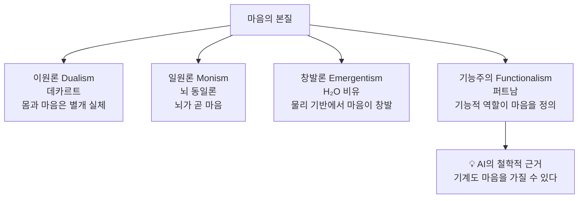

# 📅 TIL 2026-04-29: 대학원 수업_코딩과 인공지능 9주 "기계는 생각할 수 있는가?"

> **코딩과 인공지능 — 9주차** (2026.04.29)
> 심리 철학(이원론·창발론·기능주의) · 앨런 튜링 · AI·ML·DL 개념 구조
> "철학적 논변으로만 남아 있던 '생각하는 기계'가 현실이 되기까지

---

오늘 교수님의 강의에서 가장 인상 깊었던 것은, 인공지능이 단순한 공학적 산물이 아니라 철학적 사유의 결과물이라는 사실이다.
힐러리 퍼트남의 기능주의  "정신 활동이 꼭 인간의 뇌라는 물리 기반에서 나올 이유가 없다"
이 하나의 철학 논변이 "기계도 생각할 수 있다"는 AI의 이론적 정당화로 직결된다는 것을 처음으로 알았고, 정말 신기했다
또한 AlexNet(2012)이 단순히 "좋은 모델"이 아니라, GPU 병렬 처리 + 딥러닝이 결합되는 임계점 이었다는 것이 인상 깊었다.
현재 내가 공부하고 있는 GPU 그래픽스 파이프라인과 오늘의 AI 혁명이 같은 GPU 병렬 아키텍처 위에 서 있다는 연결점이 흥미로웠다.
그래픽스 엔지니어와 AI 엔지니어가 결국 같은 하드웨어를 공유하고 있다는 것 이것이 본질이 아닐까 생각한다
정말 신기했고, 막연하게 ML? DL? 그냥 인공지능 아닌가? 라고 알고 있었던 내가 부끄러워졌던, 그리고 정말 흥미로웠던 수업이었다

---

## 1️⃣ Today I Learned

### ① 심리 철학 — AI의 철학적 뿌리

인공지능을 논하기 전에 **심리 철학(Philosophy of Mind)** 을 이해해야 한다. "기계가 생각할 수 있는가?"라는 AI의 핵심 질문은 본질적으로 철학적 질문이기 때문이다.

**Mind(마인드)** 는 단순히 "마음"이 아니다. 서양 철학에서 Mind는 이성·감정·의식·지각을 아우르는 **모든 정신 활동(Brain Activity)** 을 가리킨다.

```
[마음의 개념 비교]
한국어: "마음이 어디 있어?" → 가슴을 가리킨다
영어권: Mind = Brain Activity (뇌 활동)
         감정·이성·의식 모두 뇌의 산물로 봄

심리 철학의 핵심 질문:
→ "마음(Mind)과 뇌(Brain)는 어떤 관계인가?"
→ "기계도 마음을 가질 수 있는가?"
```

---

### ② 마음을 보는 4가지 관점



| 관점 | 핵심 주장 | 대표자 | AI와의 관련성 |
|------|-----------|--------|--------------|
| 이원론 | 몸과 마음은 완전히 다른 실체 | 데카르트 | AI 가능성 부정에 가까움 |
| 일원론 | 뇌가 곧 마음 (물리적 환원) | 신경과학자들 | AI는 인간 뇌 모방에 한정 |
| 창발론 | 특정 물리 구조에서 마음이 창발 | 김재권 | 충분한 복잡성이면 AI도 의식 가능? |
| 기능주의 | 기능적 역할이 마음 — 기반은 무관 | 힐러리 퍼트남 | **AI의 직접적 철학적 정당화** |

---

### ③ 길버트 라일 — "마음의 개념"과 범주 오류

**길버트 라일(Gilbert Ryle)**, 옥스포드 대학 교수, 저서: "The Concept of Mind(1949)"

> **범주 오류(Category Mistake)**: 서로 다른 논리적 범주에 속하는 것을 같은 범주로 혼동하는 오류

```
[옥스포드 대학 비유]
관광객: "옥스포드 대학의 정문이 어디예요?"
현실: 옥스포드는 도시 안에 흩어진 컬리지들의 총합 → 정문이 없다

라일의 주장:
"마음(Mind)"도 마찬가지다.
고통·사랑·이성 등 각각의 개념들만 있을 뿐,
"마음"이라는 별도의 실체(울타리)는 존재하지 않는다.
→ 마음을 별개 실체로 보는 것이 바로 범주 오류
```

- **"기계 속의 유령(Ghost in the Machine)"** — 데카르트의 이원론을 비판한 표현
- 공각기동대(Ghost in the Shell)의 영어 제목이 바로 여기서 유래

---

### ④ 힐러리 퍼트남 — 기능주의와 다중 실현 논변

**힐러리 퍼트남(Hilary Putnam)**, 하버드 대학 철학과 교수

**다중 실현 논변(Multiple Realizability Argument)**:

```
[고통(Pain) 예시]
생리학적 정의 시도:
"고통 = C-group nerve fiber(C 그룹 신경 섬유)가 자극받는 것"

퍼트남의 반론:
개(Dog): 인간과 유전자 서열이 다름 → C-group fiber 구성도 다름
         → "그러면 개는 고통을 못 느끼는가?" → 아니다, 개도 아파한다

결론:
고통이라는 정신 상태는 특정 물리 기반에 묶이지 않는다.
같은 기능적 역할을 수행한다면
→ 인간 뇌, 동물 뇌, 외계인, 심지어 컴퓨터도 고통을 실현할 수 있다.
```

> [!important] AI로의 논리적 연결
> 기능주의 + 다중 실현 논변
> → "생각(Thinking)이라는 기능적 역할은 디지털 컴퓨터로도 실현될 수 있다"
> → 이것이 AI 연구의 철학적 정당화 근거

---

### ⑤ 앨런 튜링 — "기계는 생각할 수 있는가?"

**앨런 튜링(Alan Turing, 1912-1954)**: 튜링 머신, 세계 최초 컴퓨터 개념 설계자

논문: **"Computing Machinery and Intelligence" (1950)**
→ 첫 문장: **"Can machines think? (기계는 생각할 수 있는가?)"**

```
[이미테이션 게임 — 튜링 테스트]
심사자(인간) ←── 텍스트 채팅 ──→ [A: 인간 / B: 기계]

규칙: 심사자가 누가 기계인지 구별 못하면 → 기계는 "생각한다"
판단: 행동이 구별되지 않는다면 구별할 이유가 없다 (행동주의 기준)

튜링의 예측:
"50년 안에 튜링 테스트를 통과하는 기계가 등장할 것이다"
→ 현재 LLM(ChatGPT 등)이 사실상 통과 수준
```

> [!tip] 중국어 방 논증 (Chinese Room, John Searle, 1980)
> 튜링 테스트의 강력한 반론: 규칙 책만 보고 중국어로 답하는 영어 사용자처럼,
> 기계는 구문론(Syntax)을 처리할 뿐 의미론(Semantics)을 이해하지 못한다.
> → LLM 시대에 다시 뜨거워진 논쟁

---

### ⑥ AI · ML · DL 개념적 구조

```
┌────────────────────────────────────────┐
│     Artificial Intelligence (AI)       │
│     인공지능 — 1950년 (튜링 논문)      │
│                                        │
│   ┌────────────────────────────────┐   │
│   │    Machine Learning (ML)       │   │
│   │    기계 학습 — 1980년대~       │   │
│   │                                │   │
│   │  ┌──────────────────────────┐  │   │
│   │  │   Deep Learning (DL)     │  │   │
│   │  │   딥러닝 — 2012년~       │  │   │
│   │  │   (Deep Neural Network)  │  │   │
│   │  └──────────────────────────┘  │   │
│   └────────────────────────────────┘   │
└────────────────────────────────────────┘
```

> [!info] 현재 용어 사용 현실
> DL ⊂ ML ⊂ AI 가 개념적 관계이지만, 현재는 딥러닝이 AI의 대명사처럼 혼용된다.
> 역사적·개념적 포함 관계를 명확히 이해하는 것이 중요하다.

---

### ⑦ 프로그래밍 패러다임 vs AI 패러다임

> "규칙을 몰라. 근데 답이랑 데이터를 잔뜩 주면 거기서 규칙을 끌어내는 게 AI다." — 강의 中

```
[전통적 프로그래밍]
데이터(Data) + 규칙(Rules) ──→ 출력(Output)
예: if (스팸 키워드 포함) → 스팸 처리

[AI/ML 패러다임]
데이터(Data) + 출력(Output) ──→ 규칙(Rules) 자동 학습
예: (이메일, 스팸/정상 레이블) 수백만 개 → 스팸 판별 모델 자동 생성
```

**AI가 강력한 이유**: 규칙이 너무 복잡해서 인간이 명시하기 어려운 도메인에서 진가 발휘
- 얼굴 인식, 자연어 이해, 단백질 구조 예측 (AlphaFold)
- 생물학처럼 단일 원리로 설명하기 어려운 복잡 현상

**스팸 필터링 — AI의 첫 대규모 응용**:
- 1980년대 최초 스팸 메일 등장 → 자연어 처리 어려움 → ML 기법 도입
- 현재의 고정밀 스팸 필터로 발전한 역사적 사례

---

### ⑧ ML vs DL — Feature Extraction이 핵심 차이

**Feature(특성)**: 어떤 작업을 수행할 때 그것을 구성하는 요소

```
[오토바이 인식 모델 예시]

ML (Feature Engineering — 인간이 수동 설계):
개발자가 직접 → "바퀴 2개 + 사람이 탈 수 있는 크기 + ..."
문제: 킥보드, 외발 자전거 등 예외 케이스 처리 어려움

DL (Feature Extraction — 자동 학습):
수백만 장 이미지 → 신경망이 스스로 특성 추출
문제: 추출된 특성을 인간이 해석하기 어려움 (Black Box)
```

| 구분 | ML | DL |
|------|----|----|
| Feature 정의 | 인간이 수동 설계 | 자동 학습 |
| 데이터 요구량 | 상대적으로 적음 | 대규모 필요 |
| 해석 가능성 | 높음 | 낮음 (Black Box) |
| 복잡 패턴 처리 | 한계 있음 | 강력함 |
| 대표 알고리즘 | SVM, Random Forest | CNN, Transformer |

> [!important] 딥러닝의 핵심 혁신
> Feature Extraction의 자동화 — "오토바이를 구성하는 게 뭔지" 인간이 정의하지 않아도 신경망이 스스로 찾는다.

---

### ⑨ AlexNet (2012) — 딥러닝 혁명의 시발점

**ImageNet Challenge (ILSVRC)**: 120만 장 이미지를 1000개 클래스로 분류

```
[ImageNet 에러율 변화]
2010 : ~28% (기존 최고 수준)
2011 : ~26.2%
2012 : ~15.3% ← AlexNet 등장 → 압도적 성능 향상
2015 : ~3.6% (ResNet) → 인간 수준(~5%) 초월
현재 : ~2%대
```

**AlexNet 개발팀**: Geoffrey Hinton + Alex Krizhevsky + Ilya Sutskever (토론토 대학)

```
AlexNet의 핵심 혁신 요소:
① 깊은 CNN 구조 (5개 Conv Layer + 3개 FC Layer)
② ReLU 활성화 함수 → Sigmoid 대비 기울기 소실 완화
③ Dropout → 과적합(Overfitting) 방지
④ GPU 병렬 처리 → NVIDIA GTX 580 2대로 학습
⑤ Data Augmentation → 학습 데이터 인위적 확장
```

> [!important] GPU와 딥러닝의 연결 — 어제 TIL과의 접점
> AlexNet 성공의 핵심은 **GPU를 딥러닝 학습에 활용**한 것이다.
> GPU의 수천 개 병렬 코어(SIMT 아키텍처)가 대규모 행렬 연산에 최적화 →
> CPU 대비 수십~수백 배 빠른 학습 가능
> → 그래픽스 파이프라인의 병렬 처리(어제 TIL)와 딥러닝 학습은 **같은 GPU 위에서 작동**한다

**LeNet (1989, Yann LeCun)**: AlexNet의 원형
- 손글씨 숫자 인식 (MNIST) → 미국 우편 시스템 실적용
- 현재 번호판 인식, OCR 기술의 시조

**AI 겨울 (AI Winter)**:
- 1차 (1974~1980): 과장된 기대 후 투자 급감
- 2차 (1987~1993): Expert System 한계, 극소수만 연구 지속
- 이 시기에도 Hinton·LeCun·Bengio가 딥러닝 연구 지속 → 2012년 부활

---

## 2️⃣ Key Insights — 오늘 강의에서 깊어진 이해들

> [!success] 인사이트 1: 철학이 먼저였다
> AI는 엔지니어링으로 시작한 것이 아니다. 기능주의 철학이 "기계도 정신 활동을 구현할 수 있다"는 이론적 토대를 먼저 마련했고, 그것을 실현하는 방향으로 공학이 뒤따랐다. "기계는 생각할 수 있는가?"라는 튜링의 질문(1950)이 현재의 ChatGPT(2022)로 이어지기까지 72년이 걸렸다.

> [!success] 인사이트 2: GPU는 그래픽스와 AI를 동시에 만든다
> 어제 공부한 3D 그래픽스 파이프라인과 오늘의 AlexNet 혁명이 **같은 GPU 기술** 위에 있다는 것이 핵심 연결점이다. NVIDIA가 CUDA를 출시한 것이 2007년 — GPU를 그래픽스가 아닌 범용 계산에 쓰기 시작한 순간, 딥러닝 혁명의 하드웨어 기반이 마련됐다.

> [!success] 인사이트 3: AI 겨울의 교훈 — 극소수가 세상을 바꿨다
> Hinton·LeCun·Bengio는 두 차례의 AI 겨울 동안 거의 아무도 관심 갖지 않을 때 딥러닝을 연구했다. 논문이 나오자마자 세상이 바뀐 AlexNet처럼, 과학적 진보는 종종 오랜 침묵 끝에 임계점을 돌파한다. 연구자로서 대세를 따르지 않는 용기의 중요성을 다시 생각하게 된다.

> [!success] 인사이트 4: Feature Extraction 자동화의 의미
> ML에서 Feature Engineering이 얼마나 어렵고 전문성을 요구하는 작업인지를 이해할 때, DL이 이것을 자동화한 것의 의미가 더 분명해진다. 그러나 DL의 Black Box 문제(설명 불가능성)는 여전히 해결 중인 연구 과제이며, XAI(Explainable AI)가 활발히 연구되고 있다.

---
