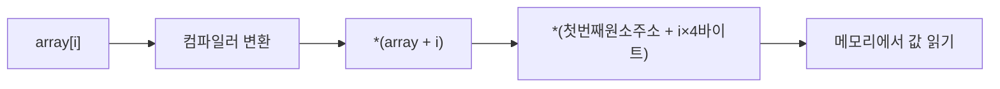

# 📅 TIL 2026-04-30: 포인터와 배열의 본질 — "배열은 포인터다, 그리고 문자열 리터럴은 읽기 전용 메모리에 산다"

> **홍정모 교수님의 따라하며 배우는 C++ — 6.8 / 6.9 / 6.10** (2026.04.30)
> 포인터와 정적 배열 · 포인터 연산과 배열 인덱싱 · C언어 스타일 문자열 심볼릭 상수
> "array[i] 는 사실 *(ptr + i) 였다
---

오늘 강의에서 가장 강하게 와닿은 것은 C++ 의 배열이 실제로는 포인터의 얇은 껍데기에 불과하다는 사실이다.
`array[i]` 와 `*(ptr + i)` 가 컴파일러 수준에서 완전히 동일하다는 것도 파악했다
오늘 배운 모든 저수준 메모리 개념이 그래픽스 파이프라인의 실제 API 설계에 반영되어 있다는 것을 체감하게 되는 강좌였고
이제 포인터에 대해 조금 친숙해진? 느낌이 든다
또.. 수요일 오전부터 4연강이라 다음날은 좀 과부하가 오긴 하는 느낌이다
1주일을 하루도 안쉬고 붙잡고 달리려니 심적으로 부담도 크고 뭔가 뇌에 부하를 걸어야 지식이 습득되는 느낌이지만, 그 부하가 너무 커버리면
제대로 공부도 못하게 되는 느낌이 들기 때문에 하루정도는 맘편하게 쉬는 날이 있어야 할 것 같다
그걸 이제부터 목요일로 하면 좋을 것 같다
그럼 내일부터 다시 달려보도록 하자

---

## 1️⃣ Today I Learned

### ① 6.8 — 배열 이름은 포인터다 (Array Decay)

**Array-to-Pointer Decay** : 배열 이름은 대부분의 표현식에서 첫 번째 원소의 주소를 가리키는 포인터로 암시적 변환된다.

```cpp
int array[5] = { 9, 7, 5, 3, 1 };

cout << array        << endl;  // 006FF878  ← 첫 번째 원소 주소
cout << &(array[0])  << endl;  // 006FF878  ← 완전히 동일!
```

```
[Array Decay 메모리 다이어그램]

Stack:
┌────┬────┬────┬────┬────┐
│  9 │  7 │  5 │  3 │  1 │
└────┴────┴────┴────┴────┘
 ↑
array (이 주소를 가리키는 포인터로 decay 됨)
```

**Decay 가 일어나지 않는 3가지 예외:**
- `sizeof(array)` → 전체 배열 크기 반환
- `&array` → 배열 전체의 주소 (타입: `int(*)[5]`)
- 배열 참조 초기화: `int (&ref)[5] = array`

---

### ② 6.8 — sizeof 의 배신: 배열 vs 포인터

```cpp
int array[5] = { 9, 7, 5, 3, 1 };

cout << sizeof(array) << endl;  // 20 (int 4바이트 × 5개)

int* ptr = array;
cout << sizeof(ptr)   << endl;  // 4  (포인터 자체의 크기, 32비트)
```

| 대상 | sizeof 결과 | 이유 |
|---|---|---|
| `int array[5]` | 20 | 전체 배열 크기 |
| `int* ptr` | 4 or 8 | 포인터 변수 크기 (32/64비트) |
| `char*` `double*` `int*` | 동일 | 타입 무관, 주소 크기만 |

> [!warning] 함수에 배열을 넘기면 sizeof 를 절대 믿으면 안 된다
> ```cpp
> void process(int arr[]) {
>     sizeof(arr); // 4 — 포인터 크기! 20 이 아님
> }
> ```
> 배열 크기는 **반드시 별도로 전달**해야 한다.

---

### ③ 6.8 — 별표 두 얼굴: 포인터 선언 vs 역참조

`*` 기호는 문맥에 따라 **완전히 다른 두 가지 의미**를 가진다.

```cpp
int* ptr = array;  // 타입 선언: "ptr 은 int 를 가리키는 포인터"
cout << *ptr;      // 역참조:    "ptr 이 가리키는 주소의 값을 읽어라"
```

| 위치 | 의미 | 예시 |
|---|---|---|
| 타입 선언 (변수명 왼쪽) | 포인터 변수 선언 | `int* ptr` |
| 표현식 내 단항 연산자 | 역참조 (dereference) | `*ptr`, `*array` |

```cpp
cout << ptr;   // 주소값 출력 (예: 006FF878)
cout << *ptr;  // 해당 주소의 값 (9)
cout << &ptr;  // ptr 변수 자체의 주소 (다른 위치!)
```

---

### ④ 6.8 — 함수 파라미터에서의 Decay 와 struct 예외

**함수 파라미터에서 배열은 항상 포인터로 변환된다:**

```cpp
// 아래 두 선언은 컴파일러에서 완전히 동일하게 처리
void printArray(int array[])  { /* ... */ }
void printArray(int* array)   { /* ... */ }

// 함수 내부에서 sizeof(array) → 4 (포인터 크기, Decay 발생)
// main() 에서 sizeof(array)   → 20 (배열 전체 크기)
```

**단, struct 안의 배열은 함수에 struct 를 넘겨도 sizeof 가 보존된다:**

```cpp
struct MyStruct { int array[5] = { 9, 7, 5, 3, 1 }; };

void doSomething(MyStruct ms) {
    sizeof(ms.array); // 20! (struct 복사 전달이라 Decay 없음)
}
```

---

### ⑤ 6.9 — uintptr_t 와 포인터 연산의 이동 단위

**`uintptr_t`**: 포인터 주소를 10진 정수로 출력·비교하기 위한 부호 없는 정수형.

```cpp
int value = 7;
int* ptr = &value;

cout << uintptr_t(ptr - 1) << endl;  // 10418680
cout << uintptr_t(ptr)     << endl;  // 10418684
cout << uintptr_t(ptr + 1) << endl;  // 10418688  ← 4 차이!
cout << uintptr_t(ptr + 2) << endl;  // 10418692
```

**핵심 규칙:**
> `ptr + n` 은 실제 주소를 `n × sizeof(타입)` 바이트만큼 이동시킨다.

```
[타입별 포인터 +1 이동량]
int*       → 4 바이트
long long* → 8 바이트
double*    → 8 바이트
char*      → 1 바이트
```

**왜 포인터에 데이터 타입이 필요한가 — 두 가지 이유:**
1. 역참조 시 "몇 바이트를 읽어서 어떤 타입으로 해석할지"
2. 포인터 연산 시 "+1 이 실제로 몇 바이트인지"

---

### ⑥ 6.9 — 배열 인덱싱과 포인터 연산은 동치다

```cpp
int array[] = { 9, 7, 5, 3, 1 };
int* ptr = array;

// 아래 세 표현은 모두 완전히 동일하다
array[i]      // 인덱스 표기
*(array + i)  // 배열 이름으로 포인터 연산
*(ptr + i)    // 포인터 변수로 포인터 연산
```

**실제 출력 (값과 주소):**
```
9  17825056
7  17825060   ← 4 차이 (int 4바이트)
5  17825064
3  17825068
1  17825072
```



대괄호 `[]` 표기법은 포인터 연산의 **문법적 설탕(Syntactic Sugar)** 이다.

---

### ⑦ 6.9 — null 종료 문자와 while break 패턴

**연습문제:** while + break + `++ptr` 을 사용해 null 문자 제외 출력

```cpp
char name[] = "JACK JACK";
// sizeof(name) = 10 (9글자 + null '\0' 1개)

char* ptr = name;
while (true) {
    if (*ptr == '\0') break;  // null 문자 → 종료
    cout << *ptr;              // 현재 문자 출력
    ++ptr;                     // 다음 문자로 이동 (1바이트)
}
// 출력: JACK JACK
```

**null 체크의 세 가지 동치 표현:**
```cpp
if (*ptr == '\0') break;  // null 문자와 직접 비교
if (*ptr == 0)    break;  // '\0' 의 정수값은 0
if (!*ptr)        break;  // *ptr 이 0(falsy) 이면 break
```

---

### ⑧ 6.10 — 문자열 리터럴과 rodata 세그먼트

**문자열 리터럴**: 소스 코드의 `"JACK JACK"` 처럼 큰따옴표로 작성된 문자열 상수.

```
[프로그램 메모리 구조]
┌─────────────────────────────┐  높은 주소
│  Stack — 지역 변수           │  char arr[] = "JACK JACK" (복사본)
├─────────────────────────────┤
│  Heap  — 동적 할당           │  new / malloc
├─────────────────────────────┤
│  .data — 초기화된 전역 변수  │
├─────────────────────────────┤
│  .rodata — 읽기 전용 데이터  │  ← "JACK JACK\0" 이 여기에 저장!
├─────────────────────────────┤
│  .text — 실행 코드           │
└─────────────────────────────┘  낮은 주소
```

```cpp
// 두 가지 선언 방식의 메모리 동작 차이
char char_arr[]  = "Hello!";   // .rodata → Stack 으로 복사 (수정 가능)
const char* name = "JACK JACK"; // .rodata 주소만 저장 (수정 불가, 복사 없음)
```

**`char*` 대신 `const char*` 를 써야 하는 이유:**
- 문자열 리터럴은 `.rodata` (읽기 전용 메모리) 에 존재
- `char*` 로 받으면 컴파일러가 수정 시도를 막아주지 않음
- 런타임에 `.rodata` 에 쓰면 OS 가 Segmentation Fault 발생

**함수 반환 시 안전한 패턴:**
```cpp
const char* getName() {
    return "JACK JACK";  // OK! .rodata 는 프로그램 종료 전까지 존재
}
// 절대 금지: 지역 char 배열 주소 반환 → Dangling Pointer
```

---

### ⑨ 6.10 — cout 이 char 포인터를 특별 처리하는 이유

```cpp
int  int_arr[5]  = { 1, 2, 3, 4, 5 };
char char_arr[]  = "Hello, World!";
const char* name = "JACK JACK";

cout << int_arr  << endl;  // 00F3FD94   ← 16진수 주소 출력
cout << char_arr << endl;  // Hello, World! ← 문자열 내용 출력
cout << name     << endl;  // JACK JACK    ← 문자열 내용 출력
```

`cout` 의 `operator<<` 는 **함수 오버로딩** 으로 타입에 따라 다르게 동작한다:

| 타입 | cout 동작 | 내부 오버로드 |
|---|---|---|
| `int*`, `void*` 등 | 주소를 16진수로 출력 | `operator<<(ostream&, void*)` |
| `char*`, `const char*` | null 까지 문자열 출력 | `operator<<(ostream&, const char*)` |

**단일 char 변수의 주소는 cout 에 직접 넣으면 안 된다:**
```cpp
char c = 'Q';
// cout << &c << endl;  // UB! Q 뒤 스택 메모리를 null 까지 읽어 쓰레기 출력
cout << c          << endl;  // 'Q' (올바름)
cout << (void*)&c  << endl;  // 주소 출력 (올바름)
```

---

### ⑩ 6.10 — 문자열 리터럴 인터닝

```cpp
const char* name  = "JACK JACK";
const char* name2 = "JACK JACK";

cout << (uintptr_t)name  << endl;  // 4225840
cout << (uintptr_t)name2 << endl;  // 4225840  ← 완전히 같은 주소!
```

컴파일러는 동일한 문자열 리터럴을 `.rodata` 에 **단 하나만 저장**하고, 해당 리터럴을 사용하는 모든 포인터가 같은 주소를 공유하도록 최적화한다. 이를 **문자열 리터럴 인터닝(String Literal Interning / Pooling)** 이라고 한다.

```
[인터닝 전]              [인터닝 후 — 실제]
.rodata: "JACK JACK\0"   .rodata: "JACK JACK\0"  ← 단 하나
.rodata: "JACK JACK\0"              ↑        ↑
          ↑                        name     name2
         name
          ↑
         name2
```

> [!warning] 주소 비교는 인터닝 결과에 의존하면 안 된다
> 인터닝은 구현 정의(implementation-defined) 사항이므로, 문자열 내용 비교는 반드시 `strcmp()` 또는 `std::string_view` 의 비교 연산을 사용해야 한다.

---

## 2️⃣ Key Insights — [참고용] 그래픽스 엔지니어 관점에서 연결되는 것들

> [!success] 인사이트 1: VBO stride 는 포인터 연산 이동 단위의 응용이다
> `glVertexAttribPointer(0, 3, GL_FLOAT, GL_FALSE, stride, offset)` 에서 stride 는 "다음 같은 종류의 속성으로 가기 위해 몇 바이트를 건너뛰는가" — 이것은 정확히 `ptr + 1` 이 `sizeof(타입)` 바이트 이동하는 포인터 연산 원리의 응용이다. 인터리브드 버퍼에서 stride 를 `sizeof(Vertex)` 로 설정하는 이유가 오늘 공부한 내용에서 자연스럽게 도출된다.

> [!success] 인사이트 2: 셰이더 소스 관리가 const char 포인터 이론 위에 있다
> `glShaderSource(shader, 1, &src, nullptr)` 에서 `src` 는 `const char*` 다. 문자열 리터럴이 `.rodata` 에 안전하게 존재한다는 사실이, Raw String Literal 로 GLSL 코드를 C++ 안에 직접 작성하고 GPU 로 전달하는 실무 패턴의 이론적 근거다.

> [!success] 인사이트 3: 배열 이름의 decay 가 데이터 전달의 핵심이다
> `glBufferData(GL_ARRAY_BUFFER, sizeof(vertices), vertices, GL_STATIC_DRAW)` 에서 `vertices` (배열 이름) 가 자동으로 `float*` 포인터로 decay 되어 GPU 드라이버에 전달된다. 이 하나의 함수 호출이 오늘 배운 Array Decay, sizeof 차이, 포인터 전달 — 세 개념이 동시에 적용된 사례다.

> [!success] 인사이트 4: GPU 메모리 접근 패턴과 캐시 지역성
> 배열이 연속 메모리에 저장되고, 포인터 연산이 `sizeof(type)` 단위로 정확히 이동한다는 특성은 CPU/GPU 캐시 라인(64바이트) 단위 프리패칭과 완벽히 맞물린다. 그래픽스 Compute Shader 에서 `threadIdx * stride` 로 메모리를 접근하는 패턴이 바로 오늘 배운 포인터 연산의 GPU 버전이다.
